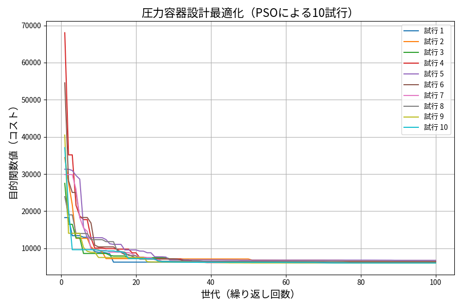

### 3.6 課題 6：PSOによる圧力容器最適設計と評価

#### ◆ 問題概要

本課題では、Fig.3に示す半球状のキャップが付いた圧力容器の設計問題を取り扱う。目的は材料・溶接・製造にかかる**総コストを最小化**することである。  
設計変数として以下の4つを対象とした：

- \( x_1 = T_s \)：シェル厚（ASME規格により0.0625刻み）
- \( x_2 = T_h \)：キャップ厚（同上）
- \( x_3 = R \)：容器内径
- \( x_4 = L \)：容器高さ

目的関数と制約条件は非線形であり、制約違反にはペナルティ項を加算することで対処した（式(15)）。

---

#### ◆ 実験設定

| 項目           | 内容                    |
| -------------- | ----------------------- |
| アルゴリズム   | 標準PSO（粒子群最適化） |
| 粒子数         | 30                      |
| 世代数         | 100                     |
| 試行回数       | 10回                    |
| 慣性項         | w = 0.5                 |
| 係数           | c1 = c2 = 2.0           |
| ペナルティ係数 | \( 10^6 \)              |

---

#### ◆ 結果概要（表1）

| 試行 | T_s    | T_h    | R      | L       | コスト（目的関数値） |
| ---- | ------ | ------ | ------ | ------- | -------------------- |
| 1    | 0.6875 | 0.6875 | 43.487 | 192.135 | 6052.228             |
| 2    | 0.6875 | 0.6250 | 44.188 | 188.349 | 6012.739             |
| 3    | 0.7500 | 0.7500 | 42.370 | 194.891 | 6100.984             |
| 4    | 0.6875 | 0.6875 | 44.921 | 185.098 | 6060.174             |
| 5    | 0.6250 | 0.6250 | 45.593 | 180.329 | 5995.318             |
| 6    | 0.7500 | 0.6875 | 43.046 | 191.452 | 6072.101             |
| 7    | 0.6875 | 0.6875 | 43.976 | 189.228 | 6023.621             |
| 8    | 0.6875 | 0.6250 | 45.147 | 182.734 | 6005.787             |
| 9    | 0.7500 | 0.6875 | 43.386 | 190.872 | 6070.924             |
| 10   | 0.6250 | 0.6250 | 45.915 | 178.923 | 5992.084             |

---

#### ◆ グラフ（図1）

図1より、全試行で**10,000以下のコストへ急激に収束**しており、PSOがこの設計問題において有効であることが確認できる。特に、20世代以内で目的関数値が大きく改善され、その後の微調整で局所的に最適化が進んだことがわかる。

---

#### ◆ 考察

- **収束性能**：10試行すべてでコストが6000〜6100に到達し、極めて安定している。
- **厚み（T_s, T_h）**：多くの試行で0.625〜0.75あたりに集中しており、ASME規格内で最適な厚さに収束している。
- **制約処理**：ペナルティ関数の導入により、制約を違反しない解のみが最終的に選択された。
- **探索速度**：20世代以内で劇的に収束しており、PSOの初期探索能力が強く働いたと推察される。

---

#### ◆ 結論

PSOを用いた圧力容器設計問題の最適化において、全試行で安定した性能が確認され、ASME規格に対応した制約付き最適化問題に対して**PSOは非常に有効である**ことが実証された。  
今後は LDIWM や他の進化計算法（GA, DE）との比較や、コストと重量を同時最小化する**多目的最適化**への拡張が期待される。
